# Architecture

## Overview

```mermaid
flowchart LR
  A[CLI: parse spec/flags] --> B[Registry client]
  B --> C[Integrity verification]
  C --> D[Safe archive extraction]
  D --> E[Snapshot generation]
  E --> F[AST analysis]
  F --> G[Detectors]
  G --> H[Delta computation]
  H --> I[Scoring]
  I --> J[Rendering: human / JSON]
```

DepCanary runs this pipeline twice per comparison — once for the "old"
coordinate, once for the "new" one — producing two independent
`BehaviorSnapshot`s, then diffs them.

## CLI flow (`src/cli/`)

`src/cli/main.ts` wires `commander` subcommands (`diff`, `doctor`,
`explain`, `all`) plus a default/bare-argument path that treats
`depcanary <a> <b>` as shorthand for `depcanary diff <a> <b>`, and
`depcanary <pkg>` as project mode. Output formatting is fully separated from
analysis: `src/cli/format-human.ts` and `src/cli/format-json.ts` take a
`ComparisonResult` and render it — no formatting logic lives inside
detectors or the analyzer, per the detector contract ("a detector must not
directly print").

## Registry resolution (`src/registry/`)

`src/registry/spec.ts` parses package specs (`name`, `@scope/name`,
`name@version`, `@scope/name@tag`) and enforces that an explicit two-sided
comparison uses the same package name on both sides.

`src/registry/client.ts` resolves a packument from the configured registry
(precedence: `--registry` flag > `NPM_CONFIG_REGISTRY`/`npm_config_registry`
env > default `https://registry.npmjs.org`), resolves the requested
version/tag, and returns the tarball URL, integrity string, shasum, and
publisher metadata where the registry provides it. Requests use a bounded
timeout and a bounded redirect count (`src/constants.ts`
`LIMITS.NETWORK_TIMEOUT_MS` / `LIMITS.MAX_REDIRECTS`), and non-HTTP(S)
tarball URLs are rejected.

## Tarball integrity (`src/registry/integrity.ts`)

When the packument's `dist.integrity` (SSRI, typically `sha512-...`) is
present, the downloaded tarball's digest is verified against it before
extraction proceeds. A mismatch throws `IntegrityError` and aborts the
comparison — DepCanary never analyzes an artifact that failed the registry's
own integrity check.

## Safe extraction (`src/archive/`)

Tarballs are treated as hostile input. `src/archive/safety.ts` validates
every entry path before it is written: rejects `../` traversal, absolute
paths, Windows drive-letter paths, and symlink/hardlink targets that would
resolve outside the extraction root. `src/archive/extract.ts` extracts only
into a freshly created OS temp directory unique to the comparison, enforces
`LIMITS.MAX_ARCHIVE_FILES`, `LIMITS.MAX_EXTRACTED_BYTES`, and
`LIMITS.MAX_ENTRY_BYTES`, and the temp directory is always removed in a
`finally` block, including on error paths.

## Snapshot generation (`src/analysis/snapshot.ts`)

Each extracted package version becomes a `BehaviorSnapshot`: manifest data
(scripts, dependencies), archive metadata (file list, sizes), a
`CodeBehaviorSnapshot` (the union of every detector's signals across every
analyzed file), and publisher metadata when the registry exposes it. Old
and new snapshots are computed independently and deterministically — a
snapshot never depends on the other side of the comparison, which is what
makes the delta layer's invariants testable in isolation.

## AST analysis (`src/analysis/ast.ts`)

Source files are parsed with `@babel/parser` in a tolerant configuration
covering modern JS, JSX, TypeScript, and TSX syntax — as data only, never
imported or executed. If a file fails to parse (malformed, exotic syntax,
adversarial input), DepCanary records a diagnostic and continues analyzing
the rest of the package rather than aborting the whole comparison. Files
larger than `LIMITS.MAX_PARSE_BYTES` are skipped for AST analysis rather
than risking a pathological parse.

## Detector model (`src/detectors/`)

Each detector (`src/detectors/index.ts` lists all twelve) implements
`analyze(context) -> Signal[]` against a single snapshot and
`diff(oldSignals, newSignals) -> Evidence[]` to decide what's genuinely new.
Detectors never print — they return typed `Evidence` records consumed by the
CLI formatters. `src/detectors/module-bindings.ts` is shared, no-typesystem
alias-resolution helper code (tracking `const { exec } = require(...)` /
`import { exec as run } from ...` locally) used by the detectors that need
to recognize aliased imports (child-process, shell-execution,
sensitive-paths, dynamic-code, network) — it is not a detector itself and
has no `DRxxx` code.

## Delta computation (`src/analysis/delta.ts`)

Delta computation is signal-identity based, not line-position based (see
"Evidence normalization" in the build contract): a signal is normalized
(e.g. `node:child_process` and `child_process` are the same identity) before
being compared old vs. new, so moving unchanged code between lines/files
does not spuriously produce a "new capability" finding. This is the
mechanism behind the core product invariant: **unchanged risky behavior
between the two versions is never reported as newly introduced.**

## Scoring (`src/scoring/`)

See [`docs/scoring.md`](scoring.md) for the full algorithm.

## Rendering (`src/cli/format-human.ts`, `src/cli/format-json.ts`)

Human output is compact, screenshot-friendly, respects `NO_COLOR` and
`--no-color`, never relies on color alone to convey severity (labels are
always printed), and has no spinners/animation. `--json` output is written
to stdout with nothing else on stdout; all diagnostics and progress go to
stderr. Both formatters run evidence text through the same terminal
sanitizer (`src/analysis/evidence.ts`) that strips/escapes control
characters, since evidence content originates from attacker-controlled
package source.

## Cache (`src/cache/cache.ts`)

A user-level, content/version-namespaced cache stores downloaded tarballs
and packument metadata keyed by package name, version, and integrity, so
repeated comparisons of the same exact version pair don't re-download.
`--no-cache` disables it; `--cache-dir` overrides the location. Cache
read/write failures degrade gracefully (DepCanary falls back to re-fetching)
rather than crashing the comparison.

## Project `--all` mode (`src/project/`)

`src/project/discover.ts` reads `package.json` and `package-lock.json`
read-only; `src/project/lockfile.ts` resolves currently-locked versions from
supported `package-lock.json` `lockfileVersion`s (2 and 3, the versions
emitted by currently supported npm releases); `src/project/updates.ts`
resolves the latest available version per direct dependency from the
registry and drives bounded-concurrency comparisons
(`LIMITS.MAX_CONCURRENT_DOWNLOADS`) with deterministic final ordering. A
`yarn.lock`/`pnpm-lock.yaml`-only project is explicitly reported as
unsupported rather than partially/incorrectly analyzed, with guidance to use
explicit version comparisons instead.

## Notable tradeoffs

- **Why no code execution**: this is a supply-chain security tool; running
  target code (even in a sandbox) would defeat the entire premise and
  introduce exactly the class of risk it exists to catch. Everything is
  static analysis over extracted, unexecuted files.
- **Why delta-first**: an absolute "this package uses risky API X" scanner
  is noisy on real-world packages (many legitimate packages use
  `child_process`, `fetch`, etc.) and doesn't answer the question a
  developer actually has when reviewing an update: _what changed_.
- **Why static analysis is incomplete**: dynamically constructed strings,
  runtime-conditional code paths, and sufficiently obfuscated payloads can
  evade static detection. DepCanary is explicit about this in
  [`docs/security-model.md`](security-model.md) rather than overclaiming.
- **Why `@babel/parser`**: it tolerantly parses modern JS/JSX/TS/TSX in one
  dependency without requiring a full TypeScript program/type-checker
  (which would be far heavier and isn't needed for capability-level static
  analysis), and handles malformed/partial input by design rather than
  throwing on the first unexpected token.
- **Why direct dependencies only for `--all` in v0.1**: a full transitive
  scan multiplies network/analysis cost and noise; the direct-dependency
  surface is what a developer is actually about to `npm update`, and is
  explicitly called out as the v0.1 boundary rather than pretending to cover
  the whole tree.
